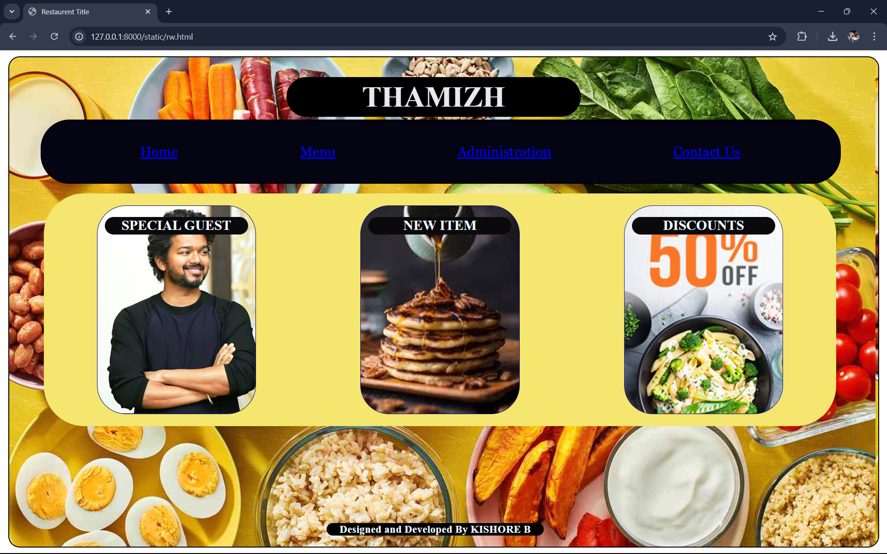
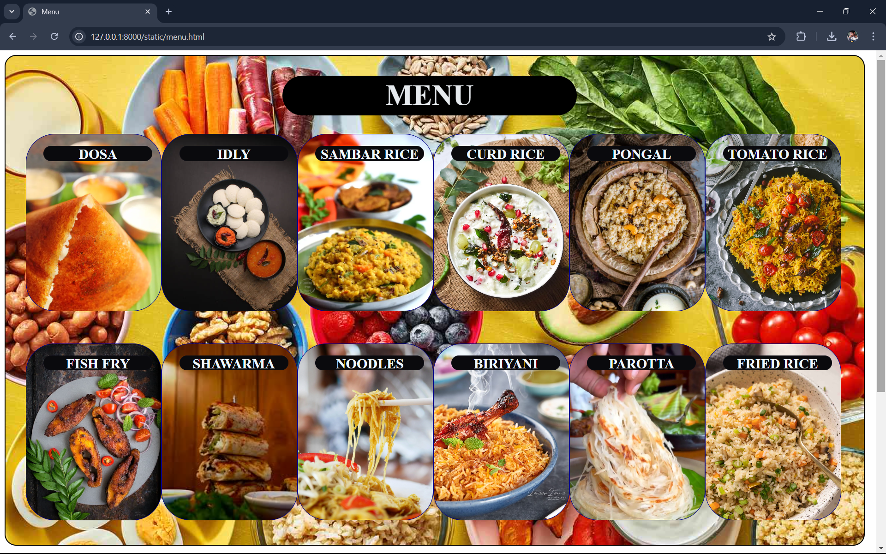
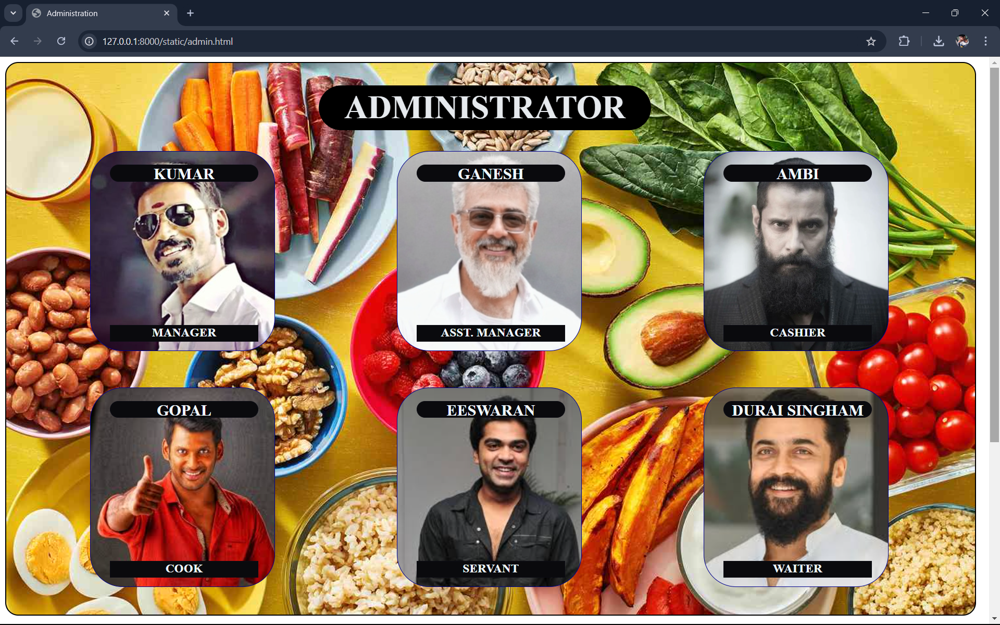
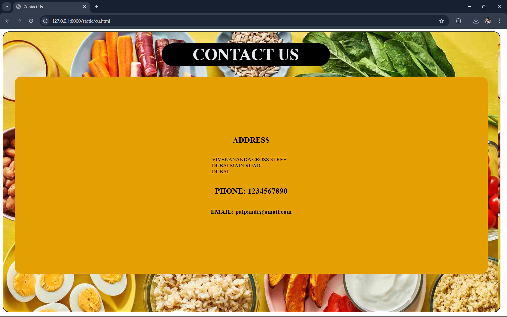

# Ex.07 Restaurant Website
## Date: 07.12.2024

## AIM:
To develop a static Restaurant website to display the food items and services provided by them.

## DESIGN STEPS:

### Step 1:
Requirement collection.

### Step 2:
Creating the layout using HTML and CSS.

### Step 3:
Updating the sample content.

### Step 4:
Choose the appropriate style and color scheme.

### Step 5:
Validate the layout in various browsers.

### Step 6:
Validate the HTML code.

### Step 7:
Publish the website in the given URL.

## PROGRAM:
```
rw.html

<html>
    <title>Restaurent Title</title>
    <head>
        <style>
body{
    display: flex ;
    justify-content: center;
    align-items: center;
}
.main{
    width: 99%;
    height: 99%;
    background-color: bisque;
    justify-content: center;
    border: 2px solid black;
    border-radius: 20px;
    background-image: url("img1.jpg");
}
.main h1{
    width: 500px;
    position: relative;
    top: 1px;
    left: 480px;
    border: 1px;
    border-radius: 100px;
    padding: 5px;
    background-color: black;
    color:rgb(230, 234, 238);
    
    font-family: 'Times New Roman', Times, serif;
    font-size:  50px;
}
.home{
    background-color: rgb(4, 4, 19);
    color: aliceblue;
    border: 2px solid black;
    border-radius: 50px;
    width: 90%;
    position: absolute;
    top: 120px;
    left: 70px;
    display: flex;
    justify-content: space-evenly;
}
.h1{
    
    margin: 20px;
    padding: 20px;
    font-family: Georgia, 'Times New Roman', Times, serif;
    font-size: x-large;
}
.contents{
    display: flex;
    align-items: center;
    flex-direction:row;
    justify-content: space-around;
    width: 91%;
    height: 400px;
    position: relative;
    top: 100px;
    left: 60px;
    border: 2px solid rgb(244, 230, 110);
    background-color: rgb(244, 230, 110);
    border-radius: 70px;
}
.m1{
    display: flex;
    
    justify-content: center;
    
    width: 20%;
    height: 90%;
    color: rgb(217, 223, 230,217);
    background-image: url("vig1.jpg");
    background-size: cover;
    background-color: darkblue;
    border: 1px solid darkblue;
    border-radius: 50px;
}
h2{
    
    color: aliceblue;
    border: 1px solid rgb(12, 12, 20);
    background-color: rgb(10, 10, 13);
    width: 90%;
    height: 8%;
    border-radius: 80px;  
}
.m2{
    display: flex;
    justify-content: center;
    width: 20%;
    height: 90%;
    color: aliceblue;
    background-image: url("food.jpeg");
    background-size: cover;
    background-color: darkblue;
    border: 1px solid darkblue;
    border-radius: 50px;
}
.m3{
    display: flex;
    justify-content: center;
    width: 20%;
    height: 90%;
    color: aliceblue;
    background-image: url("food2.jpg");
    background-size: cover;
    background-color: rgb(30, 30, 187);
    border: 1px solid rgb(17, 17, 164);
    border-radius: 50px;
}
.foot{
    border: 2px;
    width: 25%;
    border-radius: 60px;
    background-color: black;
    color: aliceblue;
    position: relative;
    bottom: -250px;
    left: 550px;
}
        </style>
    </head>
    <body>
        <div class="main">
            <h1 align="center">THAMIZH</h1>
            <div class="home">
                <div class="h1"><a href="home.html">Home</a></div>
                <div class="h1"><a href="menu.html">Menu</a></div>
                <div class="h1"><a href="admin.html">Administration</a></div>
                <div class="h1"><a href="cu.html">Contact Us</a></div>
            </div>
            <div class="contents">
                 <div class="m1">
                    <h2 align="center">SPECIAL GUEST</h2>
                    
                 </div>
                 <div class="m2">
                    <h2 align="center">NEW ITEM</h2>
                 </div>
                 <div class="m3">
                    <h2 align="center">DISCOUNTS</h2>
                 </div>
            </div>
            <div class="foot">
                <h3 align="center">Designed and Developed By KISHORE B</h3>
            </div>
        </div>
    </body>
</html>

home.html

<html>
    <title>Restaurent Title</title>
    <head>
        <style>
body{
    display: flex ;
    justify-content: center;
    align-items: center;
}
.main{
    width: 99%;
    height: 99%;
    background-color: bisque;
    justify-content: center;
    border: 2px solid black;
    border-radius: 20px;
    background-image: url("img1.jpg");
}
.main h1{
    width: 500px;
    position: relative;
    top: 1px;
    left: 480px;
    border: 1px;
    border-radius: 100px;
    padding: 5px;
    background-color: black;
    color:rgb(230, 234, 238);
    
    font-family: 'Times New Roman', Times, serif;
    font-size:  50px;
}
.home{
    background-color: rgb(4, 4, 19);
    color: aliceblue;
    border: 2px solid black;
    border-radius: 50px;
    width: 90%;
    position: absolute;
    top: 120px;
    left: 70px;
    display: flex;
    justify-content: space-evenly;
}
.h1{
    
    margin: 20px;
    padding: 20px;
    font-family: Georgia, 'Times New Roman', Times, serif;
    font-size: x-large;
}
.contents{
    display: flex;
    align-items: center;
    flex-direction:row;
    justify-content: space-around;
    width: 91%;
    height: 400px;
    position: relative;
    top: 100px;
    left: 60px;
    border: 2px solid rgb(244, 230, 110);
    background-color: rgb(244, 230, 110);
    border-radius: 70px;
}
.m1{
    display: flex;
    
    justify-content: center;
    
    width: 20%;
    height: 90%;
    color: rgb(217, 223, 230,217);
    background-image: url("vig1.jpg");
    background-size: cover;
    background-color: darkblue;
    border: 1px solid darkblue;
    border-radius: 50px;
}
h2{
    
    color: aliceblue;
    border: 1px solid rgb(12, 12, 20);
    background-color: rgb(10, 10, 13);
    width: 90%;
    height: 8%;
    border-radius: 80px;  
}
.m2{
    display: flex;
    justify-content: center;
    width: 20%;
    height: 90%;
    color: aliceblue;
    background-image: url("food.jpeg");
    background-size: cover;
    background-color: darkblue;
    border: 1px solid darkblue;
    border-radius: 50px;
}
.m3{
    display: flex;
    justify-content: center;
    width: 20%;
    height: 90%;
    color: aliceblue;
    background-image: url("food2.jpg");
    background-size: cover;
    background-color: rgb(30, 30, 187);
    border: 1px solid rgb(17, 17, 164);
    border-radius: 50px;
}
.foot{
    border: 2px;
    width: 25%;
    border-radius: 60px;
    background-color: black;
    color: aliceblue;
    position: relative;
    bottom: -250px;
    left: 550px;
}
        </style>
    </head>
    <body>
        <div class="main">
            <h1 align="center">THAMIZH</h1>
            <div class="home">
                <div class="h1"><a href="home.html">Home</a></div>
                <div class="h1"><a href="menu.html">Menu</a></div>
                <div class="h1"><a href="admin.html">Administration</a></div>
                <div class="h1"><a href="cu.html">Contact Us</a></div>
            </div>
            <div class="contents">
                 <div class="m1">
                    <h2 align="center">SPECIAL GUEST</h2>
                    
                 </div>
                 <div class="m2">
                    <h2 align="center">NEW ITEM</h2>
                 </div>
                 <div class="m3">
                    <h2 align="center">DISCOUNTS</h2>
                 </div>
            </div>
            <div class="foot">
                <h3 align="center">Designed and Developed By KISHORE B</h3>
            </div>
        </div>
    </body>
</html>

menu.html

<html>
    <title>Menu</title>
    <head>
        <style>
.main{
    width: 99%;
    height: 99%;
    background-color: bisque;
    justify-content: center;
    border: 2px solid black;
    border-radius: 20px;
    background-image: url("img1.jpg");
}
.main h1{
    width: 500px;
    position: relative;
    top: 1px;
    left: 480px;
    border: 1px;
    border-radius: 100px;
    padding: 5px;
    background-color: black;
    color:rgb(230, 234, 238);
    
    font-family: 'Times New Roman', Times, serif;
    font-size:  50px;
}

.h1{
    display: flex;
    justify-content: space-around;
    position: relative;
    left: 35px;
    width: 95%;
    height: 90%;
}
.h2{
    display: flex;
    justify-content: space-around;
    position: relative;
    left: 35px;
    bottom: 400px;
    width: 95%;
    height: 90%;
}
.i1{
    width: 20%;
    height: 40%;
    color: rgb(217, 223, 230,217);
    background-image: url("dosa.webp");
    background-size: cover;
    background-color: darkblue;
    border: 1px solid darkblue;
    border-radius: 50px;
}
.i2{
    width: 20%;
    height: 40%;
    color: rgb(217, 223, 230,217);
    background-image: url("idly.jpg");
    background-size: cover;
    background-color: darkblue;
    border: 1px solid darkblue;
    border-radius: 50px;
}
.i3{
    width: 20%;
    height: 40%;
    color: rgb(217, 223, 230,217);
    background-image: url("sambar.webp");
    background-size: cover;
    background-color: darkblue;
    border: 1px solid darkblue;
    border-radius: 50px;
}
.i4{
    width: 20%;
    height: 40%;
    color: rgb(217, 223, 230,217);
    background-image: url("curd.webp");
    background-size: cover;
    background-color: darkblue;
    border: 1px solid darkblue;
    border-radius: 50px;
}
.i5{
    width: 20%;
    height: 40%;
    color: rgb(217, 223, 230,217);
    background-image: url("pongal.webp");
    background-size: cover;
    background-color: darkblue;
    border: 1px solid darkblue;
    border-radius: 50px;
}
.i6{
    width: 20%;
    height: 40%;
    color: rgb(217, 223, 230,217);
    background-image: url("tomato.jpg");
    background-size: cover;
    background-color: darkblue;
    border: 1px solid darkblue;
    border-radius: 50px;
}
.i7{
    width: 20%;
    height: 40%;
    color: rgb(217, 223, 230,217);
    background-image: url("fish.jpg");
    background-size: cover;
    background-color: darkblue;
    border: 1px solid darkblue;
    border-radius: 50px;
}
.i8{
    width: 20%;
    height: 40%;
    color: rgb(217, 223, 230,217);
    background-image: url("SHAWARMA.jpeg");
    background-size: cover;
    background-color: darkblue;
    border: 1px solid darkblue;
    border-radius: 50px;
}
.i9{
    width: 20%;
    height: 40%;
    color: rgb(217, 223, 230,217);
    background-image: url("noodles.jpg");
    background-size: cover;
    background-color: darkblue;
    border: 1px solid darkblue;
    border-radius: 50px;
}
.i10{
    width: 20%;
    height: 40%;
    color: rgb(217, 223, 230,217);
    background-image: url("BIRIYANI.jpg");
    background-size: cover;
    background-color: darkblue;
    border: 1px solid darkblue;
    border-radius: 50px;
}
.i11{
    width: 20%;
    height: 40%;
    color: rgb(217, 223, 230,217);
    background-image: url("parotta.jpg");
    background-size: cover;
    background-color: darkblue;
    border: 1px solid darkblue;
    border-radius: 50px;
}
.i12{
    width: 20%;
    height: 40%;
    color: rgb(217, 223, 230,217);
    background-image: url("fried.jpg");
    background-size: cover;
    background-color: darkblue;
    border: 1px solid darkblue;
    border-radius: 50px;
}
h2{
    color: aliceblue;
    position: relative;
    left: 30px;
    border: 1px solid rgb(12, 12, 20);
    background-color: rgb(10, 10, 13);
    width: 80%;
    height: 8%;
    border-radius: 80px;
}
        </style>
    </head>
    <body>
        <div class="main">
            <h1 align="center">MENU</h1>
            
                <div class="h1">
                    <div class="i1">
                        <h2 align="center">DOSA</h2>

                    </div>
                    <div class="i2">
                        <h2 align="center">IDLY</h2>

                    </div>
                    <div class="i3">
                        <h2 align="center">SAMBAR RICE</h2>

                    </div>
                    <div class="i4">
                        <h2 align="center">CURD RICE</h2>

                    </div>
                    <div class="i5">
                        <h2 align="center">PONGAL</h2>

                    </div>
                    <div class="i6">
                        <h2 align="center">TOMATO RICE</h2>

                    </div>
                </div>
                <div class="h2">
                    <div class="i7">
                        <h2 align="center">FISH FRY</h2>

                    </div>
                    <div class="i8">
                        <h2 align="center">SHAWARMA</h2>

                    </div>
                    <div class="i9">
                        <h2 align="center">NOODLES</h2>

                    </div>
                    <div class="i10">
                        <h2 align="center">BIRIYANI</h2>

                    </div>
                    <div class="i11">
                        <h2 align="center">PAROTTA</h2>

                    </div>
                    <div class="i12">
                        <h2 align="center">FRIED RICE</h2>

                    </div>
                </div>
            
        </div>
    </body>
</html>

admin.html

<html>
    <title>Administration</title>
    <head>
        <style>
.main{
    width: 99%;
    height: 99%;
    background-color: bisque;
    justify-content: center;
    border: 2px solid black;
    border-radius: 20px;
    background-image: url("img1.jpg");
}
.main h1{
    width: 500px;
    position: relative;
    top: 1px;
    left: 480px;
    border: 1px;
    border-radius: 100px;
    padding: 5px;
    background-color: black;
    color:rgb(230, 234, 238);
    
    font-family: 'Times New Roman', Times, serif;
    font-size:  50px;
}

.h1{
    display: flex;
    justify-content: space-around;
    position: relative;
    left: 35px;
    width: 95%;
    height: 90%;
}
.h2{
    display: flex;
    justify-content: space-around;
    position: relative;
    left: 35px;
    bottom: 400px;
    width: 95%;
    height: 90%;
}
.i1{
    width: 20%;
    height: 40%;
    color: rgb(217, 223, 230,217);
    background-image: url("d.jpg");
    background-size: cover;
    background-color: darkblue;
    border: 1px solid darkblue;
    border-radius: 50px;
}
.i2{
    width: 20%;
    height: 40%;
    color: rgb(217, 223, 230,217);
    background-image: url("a.jpg");
    background-size: cover;
    background-color: darkblue;
    border: 1px solid darkblue;
    border-radius: 50px;
}
.i3{
    width: 20%;
    height: 40%;
    color: rgb(217, 223, 230,217);
    background-image: url("v.jpg");
    background-size: cover;
    background-color: darkblue;
    border: 1px solid darkblue;
    border-radius: 50px;
}
.i4{
    width: 20%;
    height: 40%;
    color: rgb(217, 223, 230,217);
    background-image: url("vi.jpeg");
    background-size: cover;
    background-color: darkblue;
    border: 1px solid darkblue;
    border-radius: 50px;
}
.i5{
    width: 20%;
    height: 40%;
    color: rgb(217, 223, 230,217);
    background-image: url("si.jpeg");
    background-size: cover;
    background-color: darkblue;
    border: 1px solid darkblue;
    border-radius: 50px;
}
.i6{
    width: 20%;
    height: 40%;
    color: rgb(217, 223, 230,217);
    background-image: url("sU.jpeg");
    background-size: cover;
    background-color: darkblue;
    border: 1px solid darkblue;
    border-radius: 50px;
}
h2{
    color: aliceblue;
    position: relative;
    left: 30px;
    border: 1px solid rgb(12, 12, 20);
    background-color: rgb(10, 10, 13);
    width: 80%;
    height: 8%;
    border-radius: 80px;  
}
h3{
    color: aliceblue;
    position: relative;
    left: 30px;
    bottom: -200px;
    border: 1px solid rgb(12, 12, 20);
    background-color: rgb(10, 10, 13);
    width: 80%;
    height: 8%;
    
}
        </style>
    </head>
    <body>
        <div class="main">
            <h1 align="center">ADMINISTRATOR</h1>
            
                <div class="h1">
                    <div class="i1">
                        <h2 align="center">KUMAR</h2>
                        <h3 align="center">MANAGER</h3>
                    </div>
                    <div class="i2">
                        <h2 align="center">GANESH</h2>
                        <h3 align="center">ASST. MANAGER</h3>
                    </div>
                    <div class="i3">
                        <h2 align="center">AMBI</h2>
                        <h3 align="center">CASHIER</h3>
                    </div>
                </div>
                <div class="h2">
                    <div class="i4">
                        <h2 align="center">GOPAL</h2>
                        <h3 align="center">COOK</h3>
                    </div>
                    <div class="i5">
                        <h2 align="center">EESWARAN</h2>
                        <h3 align="center">SERVANT</h3>
                    </div>
                    <div class="i6">
                        <h2 align="center">DURAI SINGHAM</h2>
                        <h3 align="center">WAITER</h3>
                    </div>
                </div>
            
        </div>
    </body>
</html>

cu.html

<html>
    <title>Contact Us</title>
    <head>
        <style>
.main{
    width: 99%;
    height: 99%;
    background-color: bisque;
    justify-content: center;
    border: 2px solid black;
    border-radius: 20px;
    background-image: url("img1.jpg");
}
.main h1{
    width: 500px;
    position: relative;
    top: 1px;
    left: 480px;
    border: 1px;
    border-radius: 100px;
    padding: 5px;
    background-color: black;
    color:rgb(230, 234, 238);
    
    font-family: 'Times New Roman', Times, serif;
    font-size:  50px;
}
.det{
    display: flex;
    flex-direction: column;
    align-items: center;
    justify-content: center;
    position: relative;
    left: 35px;
    width: 95%;
    height: 70%;
    border: 2px solid rgb(228, 160, 2);
    border-radius: 20px;
    background-color: rgb(228, 160, 2);
}
        </style>
    </head>
    <body>
        <div class="main">
            <h1 align="center">CONTACT US</h1>
            <div class="det">
                <h2 align="center">ADDRESS</h2>
                <p>VIVEKANANDA CROSS STREET,<BR>
                    DUBAI MAIN ROAD,<br>
                    DUBAI
                </p>
                <h2 align="center"> PHONE: 1234567890</h2>
                <h3>EMAIL: palpandi@gmail.com</h3>
            </div>
        </div>
    </body>
</html>
```

## OUTPUT:





## RESULT:
The program for designing software company website using HTML and CSS is completed successfully.
